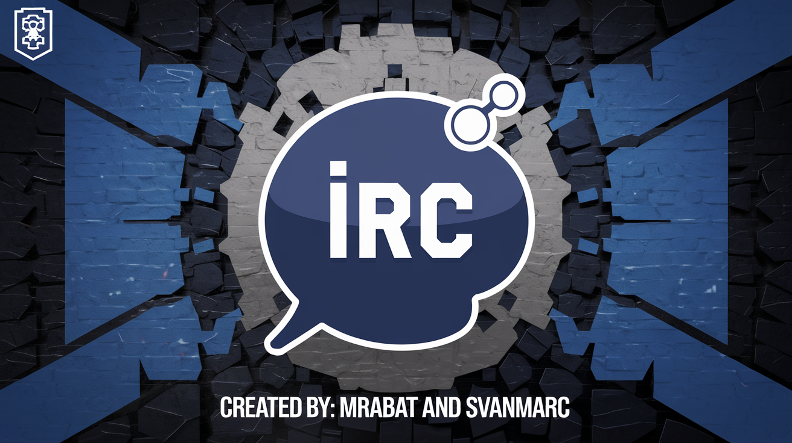

# IRC Server Project



## Introduction

This is a group-project for [42Perpignan](https://42perpignan.fr/) school's curriculum.

Created by [mrabat](https://github.com/rabatm) and [svanmarc](https://github.com/svanmarc)

It is about implementing a IRC-server, designed to handle multiple clients without hanging and uses non-blocking I/O
operations,
following the [Internet Relay Chat Protocol](https://datatracker.ietf.org/doc/html/rfc1459#section-1.1).

### Requirements

- C++ 98 compiler
- An IRC client ([IRSS](https://irssi.org/) recommended)

### Usage

To compile and run the server, execute the following commands:

```
make
./ircserv <port> <password>
```

- `port`: The port number on which your IRC server will be listening for incoming IRC connections.
- `password`: The connection password required by any IRC client trying to connect to your server.

### Features

- Authenticate, set a nickname, and a username
- Join a channel
- Send and receive private messages
- Forward messages from one client to all other clients in the channel
- Support for operators and regular users

### Commands

the right syntax for the listed commands is explained in
the [protocol](https://datatracker.ietf.org/doc/html/rfc1459#section-4.4.2).

#### Registration Commands

- `PASS`: Requires password
- `NICK`: Set nickname
- `USER`: Set Username

#### Basic Commands

- `NICK`: Set nickname
- `PRIVMSG`: Sends a message to recipient
- `NOTICE`: Sends a message to recipient (slightly different behavior)
- `LIST`: Lists all the channels
- `WHO` : Lists all the users in a channel
- `TOPIC`: Show the topic of a channel
- `JOIN`: Join a channel
- `PART`: Leave a channel
- `QUIT`: Leave the server
- `SHOWTIME BOT`: Activates the bot

#### Channel Operator Commands

- `KICK`: Eject a client from the channel
- `INVITE`: Invite a client to a channel
- `TOPIC`: Change or view the channel topic
- `MODE`: Change the channel's mode
    - `i`: Set/remove Invite-only channel
    - `t`: Set/remove the restrictions of the TOPIC command to channel operators
    - `k`: Set/remove the channel key (password)
    - `o`: Give/take channel operator privilege
    - `l`: Set/remove the user limit to the channel

### To-Do List

#### Basic Features

- [x] Authenticate, set a nickname, and a username
- [x] Join a channel
- [x] Send and receive private messages
- [ ] Forward messages from one client to all other clients in the channel
- [ ] Support for operators and regular users

#### Commands

The right syntax for the listed commands is explained in
the [protocol](https://datatracker.ietf.org/doc/html/rfc1459#section-4.4.2).

##### Registration Commands

- [X] `PASS`: Requires password
- [x] `NICK`: Set nickname
- [x] `USER`: Set Username

##### Basic Commands

- [x] `NICK`: Set nickname
- [X] `PRIVMSG`: Sends a message to recipient
- [X] `NOTICE`: Sends a message to recipient (slightly different behavior)
- [ ] `LIST`: Lists all the channels
- [ ] `WHO`: Lists all the users in a channel
- [ ] `TOPIC`: Show the topic of a channel
- [X] `JOIN`: Join a channel
- [X] `PART`: Leave a channel
- [X] `QUIT`: Leave the server
- [ ] `SHOWTIME BOT`: Activates the bot

##### Channel Operator Commands

- [ ] `KICK`: Eject a client from the channel
- [ ] `INVITE`: Invite a client to a channel
- [ ] `TOPIC`: Change or view the channel topic
- [-] `MODE`: Change the channel's mode
    - [X] `i`: Set/remove Invite-only channel
    - [ ] `t`: Set/remove the restrictions of the TOPIC command to channel operators
    - [ ] `k`: Set/remove the channel key (password)
    - [ ] `o`: Give/take channel operator privilege
    - [ ] `l`: Set/remove the user limit to the channel

##### Server Operator Commands

- [ ] `OPER`: Become server operator with right password
- [ ] `GLOBOPS`: Send a message to all server operators
- [ ] `KILL`: Remove a user from the server

#### Technical Notes

- [ ] The server must be able to handle multiple clients simultaneously and never block.
- [ ] Forking is not allowed.
- [ ] All I/O operations must be non-blocking.
- [ ] Communication between the client and server must be via TCP/IP (v4 or v6).

### Additional Tasks

- [ ] Test all commands to ensure they work correctly.
- [ ] Document the code and features.
- [ ] Add unit tests for critical functions.
- [ ] Optimize server performance.
- [ ] Ensure compatibility with existing IRC clients.
- [ ] Implement a robust error handling system.
